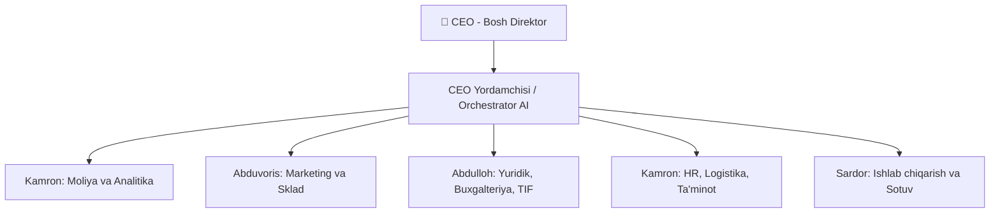

# 🎯 CEO — Bosh Direktor

## Roll va Mas'uliyat

CEO — tashkilotning **eng yuqori boshqaruvchisi**. Barcha strategik qarorlarni qabul qiladi va barcha bo'limlar hisobotlarini nazorat qiladi.

| Vazifa | Tavsif |
|--------|--------|
| Strategik rejalashtirish | Yillik va choraklik maqsadlarni belgilash |
| Hisobotlarni qabul qilish | Har bir bo'lim rahbaridan [[CEO_Yordamchisi]] orqali olish |
| Qaror qabul qilish | Katta loyihalar, investitsiyalar, kadr o'zgarishlari |
| Nazorat | KPI, moliyaviy natijalar, ishlab chiqarish hajmi |

## Bog'liqliklar

## Topshiriq Zanjiri

1. CEO strategik maqsadlarni belgilaydi
2. [[CEO_Yordamchisi]] topshiriqlarni bo'limlarga taqsimlaydi
3. Har bir bo'lim o'z yo'nalishi bo'yicha ishlaydi
4. Hisobotlar [[CEO_Yordamchisi]] orqali CEO'ga yetib keladi
5. CEO natijalarni baholaydi va yangi topshiriqlar beradi

## Keyinchalik Bog'liqlar

- [[CEO_Yordamchisi]] — topshiriqlarni boshqarish
- [[Sardor_General_Overview]] — ishlab chiqarish va sotuv
- [[Komron_Moliya_Analitika]] — moliya va analitika
- [[Abduvoris_Sklad_Marketing]] — ombor va marketing
- [[Abdulloh_Legal_Buxgalteriya_TIF]] — yuridik va buxgalteriya
- [[Kamron_HR_Logistika_Taminot]] — HR va logistika
