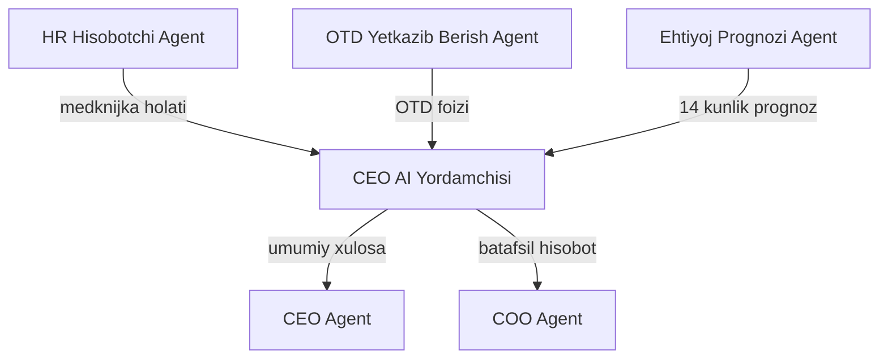

# 🧭 CEO AI Yordamchisi — XAMXAM Umumiy Xulosa Agenti

Kamronning uchta departamenti (HR, Logistika, Ta'minot) — XAMXAM AI arxitekturasi asosida — o'z natijalarini avtomatik ravishda shu agentga jamlaydi. Bu agent CEO va COO uchun yagona, qisqa va real vaqtdagi operatsion xulosa tayyorlaydi.

## Bog'langan Departamentlar

| Departament | Bot Router | Target KPI | Asosiy Chiquvchi Fayl |
|---|---|---|---|
| [[HR_Departamenti]] | `@xamxam_hr_bot` | 100% Medknijka Nazorati | [[HR_Hisobotchi_Agent]] |
| [[Logistika_Departamenti]] | `@xamxam_logistika_bot` | OTD >= 96% | [[OTD_Yetkazib_Berish_Agent]] |
| [[Taminot_Departamenti]] | `@xamxam_taminot_bot` | 14 Kunlik Prognoz | [[Ehtiyoj_Prognozi_Agent]] |

## ERP Kiruvchi (Inputs)

| Manba | Ma'lumot turi | chastotasi |
|-------|---------------|------------|
| [[HR_Hisobotchi_Agent]] | Davomat, medknijka, xodim holati | Kunlik |
| [[OTD_Yetkazib_Berish_Agent]] | OTD foizi, kechikishlar | Kunlik |
| [[Ehtiyoj_Prognozi_Agent]] | 14 kunlik xomashyo prognozi | Haftalik |

## ERP Chiquvchi (Outputs)

| Qabul qiluvchi | Ma'lumot turi | chastotasi |
|----------------|---------------|------------|
| [[CEO_Agent]] | Yagona operatsion xulosa | Kunlik |
| [[COO_Agent]] | Batafsil operatsion hisobot | Kunlik |

## Cascade Rules

## Keyinchalik Bog'liqlar

- [[HR_Departamenti]] — HR AI
- [[Logistika_Departamenti]] — Logistika AI
- [[Taminot_Departamenti]] — Ta'minot AI
- [[CEO_Yordamchisi]] — bosh orchestrator
- [[CEO_Agent]] — strategik qarorlar
- [[COO_Agent]] — operatsion boshqaruv
