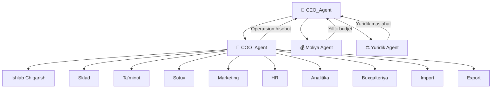

# 🎯 CEO Agent — Bosh Direktor

## Roll va Mas'uliyat

CEO — tashkilotning **eng yuqori boshqaruvchisi**. Strategik qarorlarni qabul qiladi, budjetni tasdiqlaydi va barcha bo'limlar rahbarlaridan hisobot oladi.

## ERP Tizimidagi O'rni

## Topshiriqlar Zanjiri

| Vazifa | Qabul qiluvchi | Muddati |
|--------|----------------|---------|
| Yillik strategiya tasdig'i | [[COO_Agent]] | Yanvar |
| Yillik budjet tasdig'i | [[Moliya_Agent]] | Yanvar |
| Katta loyiha qarori | [[COO_Agent]] | Kerak bo'lganda |
| Kadr o'zgarishlari | [[HR_Agent]] | Kerak bo'lganda |
| Yuridik nizolar | [[Yuridik_Agent]] | Kerak bo'lganda |

## Keyinchalik Bog'liqlar

- [[COO_Agent]] — operatsion boshqaruv
- [[CEO_Yordamchisi]] — topshiriqlarni taqsimlash
- [[Moliya_Agent]] — budjet va moliya
- [[Yuridik_Agent]] — yuridik maslahat
- [[Analitika_Agent]] — strategik tahlillar
- [[HR_Agent]] — kadr masalalari
