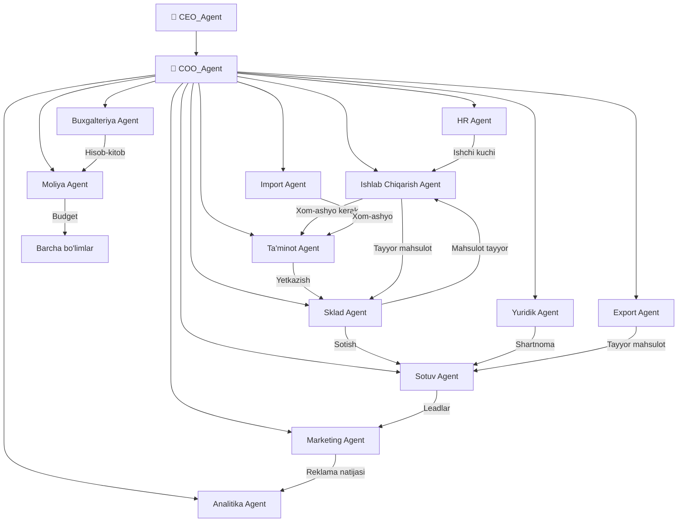

# 🏢 COO Agent — Operatsion Direktor

## Roll va Mas'uliyat

COO (Chief Operating Officer) — **operatsion jarayonlarni boshqaradi**. Barcha bo'limlararo ish oqimlarini muvofiqlashtiradi va operatsion samaradorlikni nazorat qiladi.

## 12 Bo'limli ERP Modeli

## Operatsion Zanjir

| Bosqich | Bo'lim | Harakat |
|---------|--------|---------|
| 1 | [[Marketing_Agent]] | Lead yaratish, reklama |
| 2 | [[Sotuv_Agent]] | Lead → zakazga aylantirish |
| 3 | [[Sklad_Agent]] | Mahsulot mavjudligini tekshirish |
| 4 | [[Ishlab_Chiqarish_Agent]] | Yetishmayotgan mahsulotni ishlab chiqarish |
| 5 | [[Taminot_Agent]] | Xom-ashyo yetkazish |
| 6 | [[Export_Agent]] | Xorijiy buyurtmalarni bajarish |
| 7 | [[Buxgalteriya_Agent]] | To'lov va hisob-kitob |
| 8 | [[Moliya_Agent]] | Budjet nazorati |

## Keyinchalik Bog'liqlar

- [[CEO_Agent]] — strategik topshiriqlar manbai
- [[Ishlab_Chiqarish_Agent]] — ishlab chiqarish jarayoni
- [[Sklad_Agent]] — ombor boshqaruvi
- [[Taminot_Agent]] — xom-ashyo ta'minoti
- [[Sotuv_Agent]] — sotuv jarayoni
- [[Marketing_Agent]] — marketing kampaniyalari
- [[Moliya_Agent]] — moliyaviy boshqaruv
- [[Buxgalteriya_Agent]] — buxgalteriya hisoblari
- [[Analitika_Agent]] — tahliliy hisobotlar
- [[HR_Agent]] — inson resurslari
- [[Yuridik_Agent]] — yuridik maslahat
- [[Import_Agent]] — import operatsiyalari
- [[Export_Agent]] — export operatsiyalari
