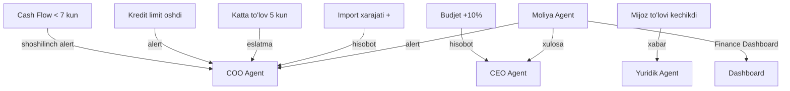

# 💰 Moliya Agent — Finance Module

> **Owner:** Komron | **Modul:** Moliya | **Output:** Finance Dashboard

## 📊 Finance Dashboard

Dashboard'da quyidagilar ko'rinadi:

| # | Ko'rsatkich | Tavsif |
|---|-------------|--------|
| 1 | Jami pul qoldig'i | Bank + kassa jami |
| 2 | Oylik tushum | Barcha manbalardan tushgan |
| 3 | Oylik xarajat | Barcha kategoriyalar bo'yicha |
| 4 | Sof foyda / zarar | Tushum − Xarajat |
| 5 | Debitor qarzdorlik | Mijozlar qarzi |
| 6 | Kreditor qarzdorlik | Yetkazib beruvchilarga qarz |
| 7 | Budjet reja/fakt | Reja vs Fakt taqqoslash |
| 8 | Cash Flow prognozi | 7 / 14 / 30 kunlik |

---

## 💸 Moliyaviy bloklar

### A. Cash Flow

| Element | Tavsif |
|---------|--------|
| Kirimlar | Barcha tushumlar |
| Chiqimlar | Barcha xarajatlar |
| Kutilayotgan to'lovlar | Kelajakdagi majburiyatlar |
| Kutilayotgan mijoz to'lovlari | Mijozlardan kutilayotgan |
| Bank hisobidagi qoldiq | Joriy bank balansi |
| Pul yetishmovchiligi prognozi | 7/14/30 kunlik prognoz |

### B. Tushum va Foyda

| Element | Tavsif |
|---------|--------|
| Kunlik / oylik tushum | Sotuv + boshqa tushumlar |
| Mahsulotlar bo'yicha tushum | Har bir mahsulot turi |
| Mahsulotlar bo'yicha foyda | Har bir mahsulot foydasi |
| Ichki sotuv va export tushumi | Lokal + xorijiy |
| Yalpi marja | Bruto foyda |

### C. Xarajatlar

| Element | Tavsif |
|---------|--------|
| Xarajat kategoriyalari | Turli xarajat turlari |
| Reja va fakt | Reja vs Fakt |
| Budjetdan oshish | Qancha oshgan |
| Bo'limlar kesimida | Har bir bo'lim |
| Ishlab chiqarish tannarxi | Zavod xarajatlari |

### D. Qarzdorlik

| Element | Tavsif |
|---------|--------|
| Mijozlar qarzdorligi | Debitor qarz |
| Muddati o'tgan qarzdorlik | Overdue |
| Yetkazib beruvchilarga qarz | Kreditor qarz |
| To'lov muddati yaqin majburiyatlar | Yaqinlashayotgan to'lovlar |

---

## 📥 Moliya Agent oladigan ma'lumotlar (inputs_from)

| # | Bo'lim | Keladigan ma'lumot | chastotasi |
|---|--------|-------------------|------------|
| 1 | [[Sotuv_Agent]] | Buyurtma, narx, mijoz, to'lov muddati | Kunlik |
| 2 | [[Buxgalteriya_Agent]] | Invoice, real to'lov, xarajat, soliq | Kunlik |
| 3 | [[Taminot_Agent]] | Xarid so'rovi, xarid summasi | Haftalik |
| 4 | [[Ishlab_Chiqarish_Agent]] | Tannarx, xomashyo sarfi | Oylik |
| 5 | [[Import_Agent]] | Kontrakt, bojxona va logistika xarajati | Kerak bo'lganda |
| 6 | [[Export_Agent]] | Valyuta tushumi, eksport to'lovi | Kerak bo'lganda |
| 7 | [[HR_Agent]] | Ish haqi va bonus xarajatlari | Oylik |
| 8 | [[Marketing_Agent]] | Reklama budjeti va sarfi | Oylik |

---

## ⚙️ Moliya Agent qiladigan ishlar

| # | Vazifa | Tavsif |
|---|--------|--------|
| 1 | Cash Flow hisoblash | Kirim/chiqim saldo |
| 2 | Budjet va faktni solishtirish | Reja vs Fakt |
| 3 | Xarajat oshganini aniqlash | 10%+ oshish |
| 4 | Mijoz qarzdorligini tekshirish | Debitor monitoring |
| 5 | To'lov muddati o'tganini aniqlash | Overdue detection |
| 6 | Pul yetishmovchiligi riskini aniqlash | Cash flow prognoz |
| 7 | COO Agentga alert yuborish | Shoshilinch holatlar |
| 8 | CEO Agent uchun xulosa tayyorlash | Qisqa moliyaviy xulosa |

---

## 🚨 Moliya Agent alertlari

| # | Alert | Trigger | Qabul qiluvchi |
|---|-------|---------|----------------|
| 1 | Cash Flow 7 kundan kam qoldi | Cash flow < 7 kun | [[COO_Agent]] |
| 2 | Budjet 10% dan ko'p oshdi | Budget variance > 10% | [[CEO_Agent]] |
| 3 | Mijoz to'lovi kechikdi | To'lov muddati o'tgan | [[Yuridik_Agent]] |
| 4 | Mijoz kredit limiti oshdi | Credit limit exceeded | [[COO_Agent]] |
| 5 | Katta to'lov muddati yaqinlashdi | To'lov 5 kun ichida | [[COO_Agent]] |
| 6 | Import xarajati rejalashtirilgandan oshdi | Import cost > plan | [[COO_Agent]] |

---

## 📤 Moliya Agent chiqishi (outputs_to)

| Qabul qiluvchi | Ma'lumot | chastotasi |
|----------------|----------|------------|
| [[COO_Agent]] | Moliyaviy hisobot, alertlar | Haftalik |
| [[CEO_Agent]] | Strategik moliyaviy xulosa | Oylik |
| [[Analitika_Agent]] | Moliyaviy KPI, Cash Flow | Kunlik |

---

## 🔗 Modullararo bog'liqlik

```
Buxgalteriya ────┐
Sotuv ──────────┤
Ta'minot ───────┤
Import / Export ┤──> Moliya Agent ──> Finance Dashboard
HR ─────────────┤
Ishlab chiqarish┘
```

---

## ⚡ Cascade Rules



---

## 🔗 Keyinchalik Bog'liqlar

- [[Moliya_Departamenti]] — umumiy dashboard
- [[Analitika_Departamenti]] — tahliliy hisobotlar
- [[Analitika_Agent]] — tahliliy hisobotlar
- [[COO_Agent]] — operatsion boshqaruv
- [[CEO_Agent]] — strategik qarorlar
- [[Sotuv_Agent]] — sotuv ma'lumotlari
- [[Buxgalteriya_Agent]] — buxgalteriya hisoblari
- [[Taminot_Agent]] — xarajat manbai
- [[Ishlab_Chiqarish_Agent]] — tannarx manbai
- [[Import_Agent]] — import xarajatlari
- [[Export_Agent]] — export tushumlari
- [[HR_Agent]] — ish haqi xarajatlari
- [[Marketing_Agent]] — reklama xarajatlari
- [[Yuridik_Agent]] — qarzdorlik yuridik choralari
