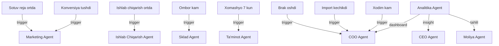

# 📈 Analitika Agent — Analytics Module

> **Owner:** Komron | **Modul:** Analitika | **Output:** Analytics Dashboard

## 📊 Analytics Dashboard

Dashboard'da quyidagilar ko'rinadi:

| # | Ko'rsatkich | Tavsif |
|---|-------------|--------|
| 1 | Company Health Score | Umumiy tashkilot salomatligi |
| 2 | Sotuv reja/fakt | Sales plan vs actual |
| 3 | Ishlab chiqarish reja/fakt | Production plan vs actual |
| 4 | Ombor qoldig'i | Warehouse stock |
| 5 | Xomashyo yetishmovchiligi | Raw material shortage |
| 6 | Marketing leadlari | Lead count |
| 7 | HR davomat va xodim soni | Attendance + headcount |
| 8 | Import/Export holati | Trade status |
| 9 | Ochiq alertlar soni | Open alerts count |

---

## 📊 Analitika bloklari

### A. Sotuv analitikasi

| Element | Tavsif |
|---------|--------|
| Sotuv reja/fakt | Plan vs actual |
| Mahsulotlar bo'yicha sotuv | By product |
| Hudud bo'yicha sotuv | By region |
| Top mijozlar | Top customers |
| Sotuv prognozi | Sales forecast |

### B. Ishlab chiqarish analitikasi

| Element | Tavsif |
|---------|--------|
| Ishlab chiqarish reja/fakt | Plan vs actual |
| Brak foizi | Defect rate |
| Tannarx | Cost of production |
| Uskuna to'xtash vaqti | Downtime |
| Quvvatdan foydalanish | Capacity utilization |

### C. Sklad analitikasi

| Element | Tavsif |
|---------|--------|
| Mahsulot qoldig'i | Stock level |
| Minimal qoldiqdan past | Below minimum |
| Sekin aylanayotgan | Slow moving |
| Yaroqlilik muddati yaqin | Near expiry |

### D. Ta'minot / Import analitikasi

| Element | Tavsif |
|---------|--------|
| Kechikayotgan yetkazib berishlar | Delayed deliveries |
| Xomashyo riski | Material risk |
| Yetkazib beruvchilar reytingi | Supplier rating |
| Import yuklari holati | Import shipment status |

### E. Marketing analitikasi

| Element | Tavsif |
|---------|--------|
| Leadlar soni | Lead count |
| Konversiya | Conversion rate |
| Reklama xarajati | Ad spend |
| Kampaniya samaradorligi | Campaign efficiency |

### F. HR analitikasi

| Element | Tavsif |
|---------|--------|
| Xodimlar soni | Headcount |
| Davomat | Attendance |
| Ochiq vakansiyalar | Open positions |
| Xodim yetishmovchiligi | Staff shortage |

### G. Export analitikasi

| Element | Tavsif |
|---------|--------|
| Eksport buyurtmalari | Export orders |
| Eksport tushumi | Export revenue |
| Mamlakatlar bo'yicha sotuv | By country |
| Yuk jo'natish holati | Shipment status |

---

## 📥 Analitika Agent oladigan ma'lumotlar (inputs_from)

| # | Bo'lim | Asosiy ma'lumot | chastotasi |
|---|--------|----------------|------------|
| 1 | [[Marketing_Agent]] | Lead, reklama, kampaniya | Kunlik |
| 2 | [[Sotuv_Agent]] | Buyurtma, tushum, mijoz, prognoz | Kunlik |
| 3 | [[Ishlab_Chiqarish_Agent]] | Reja/fakt, brak, tannarx | Kunlik |
| 4 | [[Sklad_Agent]] | Qoldiq, kirim/chiqim, zaxira | Kunlik |
| 5 | [[Taminot_Agent]] | Xarid, narx, kechikish | Haftalik |
| 6 | [[Moliya_Agent]] | Cash Flow, foyda, xarajat | Kunlik |
| 7 | [[Buxgalteriya_Agent]] | Faktik to'lov va xarajat | Kunlik |
| 8 | [[HR_Agent]] | Xodim, davomat, smena | Haftalik |
| 9 | [[Yuridik_Agent]] | Shartnoma va sertifikat riski | Oylik |
| 10 | [[Import_Agent]] | Yuk, bojxona, logistika | Haftalik |
| 11 | [[Export_Agent]] | Eksport buyurtmasi va tushum | Haftalik |

---

## ⚙️ Analitika Agent qiladigan ishlar

| # | Vazifa | Tavsif |
|---|--------|--------|
| 1 | Barcha KPI'larni hisoblash | Har bir bo'lim bo'yicha |
| 2 | Reja va faktni solishtirish | Plan vs actual |
| 3 | Bo'limlardagi muammolarni aniqlash | Problem detection |
| 4 | Muammo sababini bog'lash | Root cause analysis |
| 5 | Prognoz berish | Forecasting |
| 6 | Company Health Score hisoblash | Umumiy baho |
| 7 | COO Agentga xulosa yuborish | Operatsion xulosa |
| 8 | CEO Agentga insight yuborish | Strategik insight |

---

## 🚨 Analitika Agent alertlari

| # | Alert | Trigger | Qabul qiluvchi |
|---|-------|---------|----------------|
| 1 | Sotuv reja ortda qoldi | Sales plan lag > 20% | [[Marketing_Agent]] |
| 2 | Ishlab chiqarish reja ortda | Production plan lag > 20% | [[Ishlab_Chiqarish_Agent]] |
| 3 | Omborda mahsulot kam | Stock < minimum | [[Sklad_Agent]] |
| 4 | Xomashyo 7 kundan kamga yetadi | Material < 7 days | [[Taminot_Agent]] |
| 5 | Brak foizi oshdi | Defect rate > 5% | [[COO_Agent]] |
| 6 | Marketing konversiyasi tushdi | Conversion drop > 15% | [[Marketing_Agent]] |
| 7 | Import yuki kechikdi | Import delayed > 5 days | [[COO_Agent]] |
| 8 | Xodim yetishmovchiligi ishga ta'sir | Staff shortage > 10% | [[COO_Agent]] |

---

## 📤 Analitika Agent chiqishi (outputs_to)

| Qabul qiluvchi | Ma'lumot | chastotasi |
|----------------|----------|------------|
| [[COO_Agent]] | Umumiy dashboard, KPI, xulosa | Haftalik |
| [[CEO_Agent]] | Strategik tahlillar, risklar | Oylik |
| [[Moliya_Agent]] | Moliyaviy tahlillar | Kunlik |
| [[Marketing_Agent]] | Bozor tahlili | Oylik |

---

## 🔗 Modullararo bog'liqlik

```
Barcha bo'limlar
       ↓
Analitika Agent
       ↓
Analytics Dashboard
       ↓
COO Agent
       ↓
CEO Agent
```

---

## ⚡ Cascade Rules



---

## 🔗 Keyinchalik Bog'liqlar

- [[Analitika_Departamenti]] — umumiy dashboard
- [[Moliya_Departamenti]] — moliyaviy tahlillar
- [[Moliya_Agent]] — moliyaviy tahlillar
- [[COO_Agent]] — operatsion boshqaruv
- [[CEO_Agent]] — strategik qarorlar
- [[Marketing_Agent]] — bozor tahlili
- [[Sotuv_Agent]] — sotuv ma'lumotlari
- [[Ishlab_Chiqarish_Agent]] — ishlab chiqarish ma'lumotlari
- [[Sklad_Agent]] — ombor ma'lumotlari
- [[Taminot_Agent]] — ta'minot ma'lumotlari
- [[Buxgalteriya_Agent]] — buxgalteriya ma'lumotlari
- [[HR_Agent]] — HR ma'lumotlari
- [[Yuridik_Agent]] — yuridik risklar
- [[Import_Agent]] — import ma'lumotlari
- [[Export_Agent]] — export ma'lumotlari
