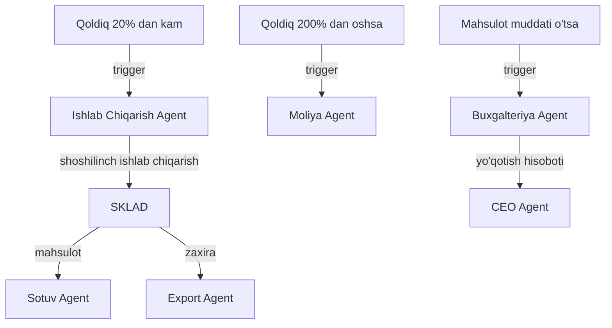

# 🏗️ Sklad Agent — Ombor Boshqaruvi

## ERP输入 (inputs_from)

| Manba | Ma'lumot turi | chastotasi |
|-------|---------------|------------|
| [[Ishlab_Chiqarish_Agent]] | Tayyor mahsulot | Har smena |
| [[Taminot_Agent]] | Xom-ashyo qabuli | Kunlik |
| [[Sotuv_Agent]] | Sotuv zakazlari | Real vaqt |
| [[Import_Agent]] | Import mahsulotlari | Kerak bo'lganda |

## ERP输出 (outputs_to)

| Qabul qiluvchi | Ma'lumot turi | chastotasi |
|----------------|---------------|------------|
| [[Ishlab_Chiqarish_Agent]] | Ombor qoldig'i | Kunlik |
| [[Sotuv_Agent]] | Mahsulot mavjudligi | Real vaqt |
| [[Export_Agent]] | Tayyor mahsulot zaxirasi | Haftalik |
| [[Analitika_Agent]] | Ombor KPI | Haftalik |
| [[Buxgalteriya_Agent]] | Ombor qiymati | Oylik |

## Cascade Rules (Zanjirli Bog'liqliklar)

| holat | Harakat | Mas'ul |
|-------|---------|--------|
| Qoldiq < 20% | [[Ishlab_Chiqarish_Agent]] ga shoshilinch buyurtma | Sklad |
| Qoldiq > 200% | [[Moliya_Agent]] ga xabar — mablag' bo'sab turibdi | Sklad |
| Mahsulot muddati o'tsa | [[Buxgalteriya_Agent]] ga yo'qotish akti | Sklad |
| Yangi mahsulot keldi | [[Sotuv_Agent]] ga xabar — sotish mumkin | Sklad |

## Keyinchalik Bog'liqlar

- [[Sardor_General_Overview]] — umumiy dashboard
- [[Ishlab_Chiqarish_Agent]] — mahsulot manbai
- [[Taminot_Agent]] — xom-ashyo yetkazish
- [[Sotuv_Agent]] — sotuv zakazlari
- [[Import_Agent]] — import mahsulotlari
- [[Export_Agent]] — export uchun zaxira
- [[Analitika_Agent]] — ombor KPI
- [[Buxgalteriya_Agent]] — ombor qiymati
- [[Moliya_Agent]] — moliyaviy nazorat
- [[COO_Agent]] — operatsion boshqaruv
