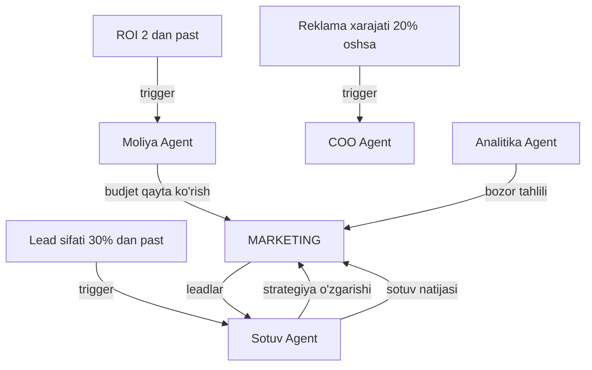

# 📣 Marketing Agent

## ERP输入 (inputs_from)

| Manba | Ma'lumot turi | chastotasi |
|-------|---------------|------------|
| [[Analitika_Agent]] | Bozor tahlili, raqobatchilar | Oylik |
| [[Sotuv_Agent]] | Sotuv natijalari, lead sifati | Haftalik |
| [[Moliya_Agent]] | Marketing budjeti | Oylik |

## ERP输出 (outputs_to)

| Qabul qiluvchi | Ma'lumot turi | chastotasi |
|----------------|---------------|------------|
| [[Sotuv_Agent]] | Yangi leadlar, kampaniya natijalari | Kunlik |
| [[Analitika_Agent]] | Marketing KPI, ROI | Haftalik |
| [[Buxgalteriya_Agent]] | Marketing xarajatlari | Oylik |

## Cascade Rules (Zanjirli Bog'liqliklar)

| holat | Harakat | Mas'ul |
|-------|---------|--------|
| ROI < 2 | [[Moliya_Agent]] ga budjet qayta ko'rib chiqish | Marketing |
| Lead sifati < 30% | Strategiyani o'zgartirish | Marketing |
| Reklama xarajati +20% | [[COO_Agent]] ga xabar | Marketing |
| Yangi bozor | [[Export_Agent]] ga tadqiqot | Marketing |

## Keyinchalik Bog'liqlar

- [[Sardor_General_Overview]] — umumiy dashboard
- [[Analitika_Agent]] — bozor tahlili
- [[Sotuv_Agent]] — lead manbai
- [[Moliya_Agent]] — budjet nazorati
- [[Buxgalteriya_Agent]] — xarajat hisoboti
- [[Export_Agent]] — yangi bozorlar
- [[COO_Agent]] — operatsion boshqaruv
