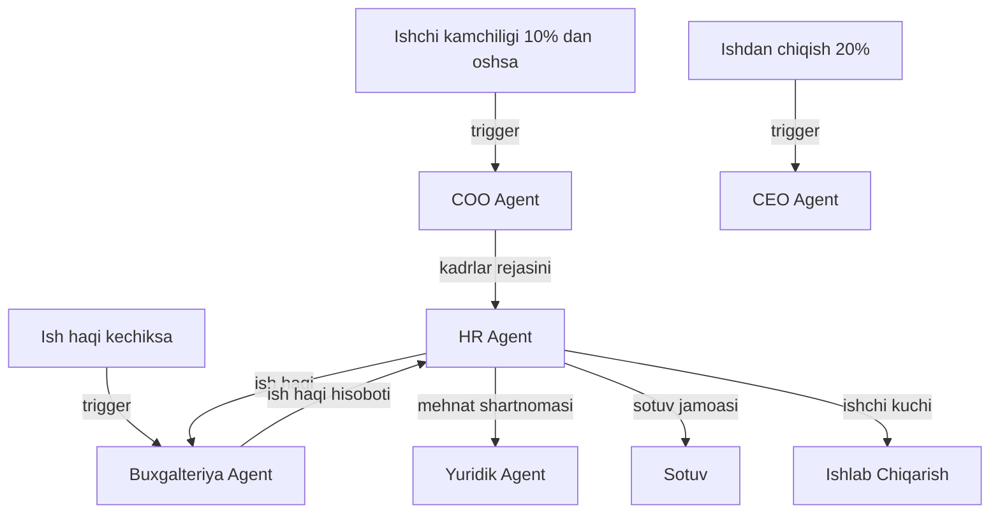

# 👥 HR Agent

> **Bot Router:** `@xamxam_hr_bot` | **Target KPI:** 100% Medknijka Nazorati

## Bo'limlar

| # | Bo'lim | Fayl |
|---|--------|------|
| 1 | Xodimlar Baza | [[Xodimlar_Baza_Agent]] |
| 2 | Smena Nazorati | [[Smena_Nazorati_Agent]] |
| 3 | Davomat Nazorati | [[Davomat_Nazorati_Agent]] |
| 4 | Medknijka Nazorati | [[Medknijka_Nazorati_Agent]] |
| 5 | HR Hisobotchi | [[HR_Hisobotchi_Agent]] |

## ERP Kiruvchi (Inputs)

| Manba | Ma'lumot turi | chastotasi |
|-------|---------------|------------|
| [[Ishlab_Chiqarish_Agent]] | Ishchi kuchi kerakligi | Haftalik |
| [[Sotuv_Agent]] | Sotuv jamoasi kerakligi | Haftalik |
| [[COO_Agent]] | Umumiy kadrlar rejasini | Oylik |
| [[Buxgalteriya_Agent]] | Ish haqi hisoboti | Oylik |

## ERP Chiquvchi (Outputs)

| Qabul qiluvchi | Ma'lumot turi | chastotasi |
|----------------|---------------|------------|
| [[Ishlab_Chiqarish_Agent]] | Ishchi kuchi ro'yxati | Haftalik |
| [[Sotuv_Agent]] | Sotuv jamoasi | Haftalik |
| [[Buxgalteriya_Agent]] | Ish haqi va imtiyozlar | Oylik |
| [[Analitika_Agent]] | HR KPI | Haftalik |
| [[Yuridik_Agent]] | Mehnat shartnomalari | Kerak bo'lganda |
| [[CEO_AI_Yordamchisi_Agent]] | Umumiy HR xulosasi | Kunlik |

## Cascade Rules (Zanjirli Bog'liqliklar)

| holat | Harakat | Mas'ul |
|-------|---------|--------|
| Ishchi kamchiligi > 10% | [[COO_Agent]] ga xabar, ishga qabul qilish | HR |
| Ishdan chiqish > 20% | [[CEO_Agent]] ga hisobot, sababini tahlil qilish | HR |
| Ish haqi kechiksa | [[Buxgalteriya_Agent]] ga shoshilinch | HR |
| Yangi xodim | [[Yuridik_Agent]] ga mehnat shartnomasi | HR |

## Keyinchalik Bog'liqlar

- [[HR_Departamenti]] — umumiy dashboard
- [[Logistika_Departamenti]] — transport xodimlari
- [[Taminot_Departamenti]] — ta'minot xodimlari
- [[Ishlab_Chiqarish_Agent]] — ishchi kuchi iste'molchisi
- [[Sotuv_Agent]] — sotuv jamoasi
- [[Buxgalteriya_Agent]] — ish haqi
- [[Analitika_Agent]] — HR KPI
- [[Yuridik_Agent]] — mehnat shartnomalari
- [[COO_Agent]] — operatsion boshqaruv
- [[CEO_Agent]] — strategik kadrlar
