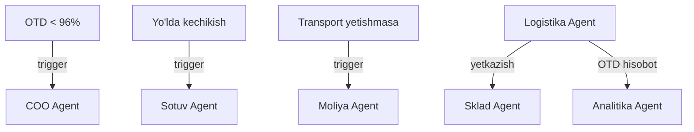

# 🚛 Logistika Agent

> **Bot Router:** `@xamxam_logistika_bot` | **Target KPI:** OTD >= 96%

## Bo'limlar

| # | Bo'lim | Fayl |
|---|--------|------|
| 1 | Transport Nazorati | [[Transport_Nazorati_Agent]] |
| 2 | Yuk Holati | [[Yuk_Holati_Agent]] |
| 3 | Marshrut Nazorati | [[Marshrut_Nazorati_Agent]] |
| 4 | Kechikish Ogohlantirish | [[Kechikish_Ogohlantirish_Agent]] |
| 5 | OTD Yetkazib Berish | [[OTD_Yetkazib_Berish_Agent]] |

## ERP Kiruvchi (Inputs)

| Manba | Ma'lumot turi | chastotasi |
|-------|---------------|------------|
| [[Sklad_Agent]] | Jo'natiladigan mahsulot | Kunlik |
| [[Sotuv_Agent]] | Yetkazib berish manzillari | Kunlik |
| [[Taminot_Agent]] | Kiruvchi yuk jadvali | Haftalik |
| [[HR_Agent]] | Haydovchilar ro'yxati | Haftalik |

## ERP Chiquvchi (Outputs)

| Qabul qiluvchi | Ma'lumot turi | chastotasi |
|----------------|---------------|------------|
| [[Sklad_Agent]] | Yetkazib berish holati | Real vaqt |
| [[Sotuv_Agent]] | OTD statusi | Kunlik |
| [[Analitika_Agent]] | Logistika KPI | Haftalik |
| [[Moliya_Agent]] | Transport xarajatlari | Oylik |

## Cascade Rules (Zanjirli Bog'liqliklar)

| Holat | Harakat | Mas'ul |
|-------|---------|--------|
| OTD < 96% | [[COO_Agent]] ga shoshilinch xabar | Logistika |
| Yo'lda kechikish | [[Sotuv_Agent]] ga ogohlantirish | Logistika |
| Transport yetishmasa | [[Moliya_Agent]] ga texnika so'rovi | Logistika |

## Keyinchalik Bog'liqlar

- [[Logistika_Departamenti]] — umumiy dashboard
- [[HR_Departamenti]] — haydovchilar
- [[Taminot_Departamenti]] — kiruvchi yuk
- [[Sklad_Agent]] — jo'natma manbai
- [[Sotuv_Agent]] — yetkazib berish manzili
- [[Analitika_Agent]] — logistika KPI
- [[Moliya_Agent]] — transport xarajatlari
- [[COO_Agent]] — operatsion boshqaruv
