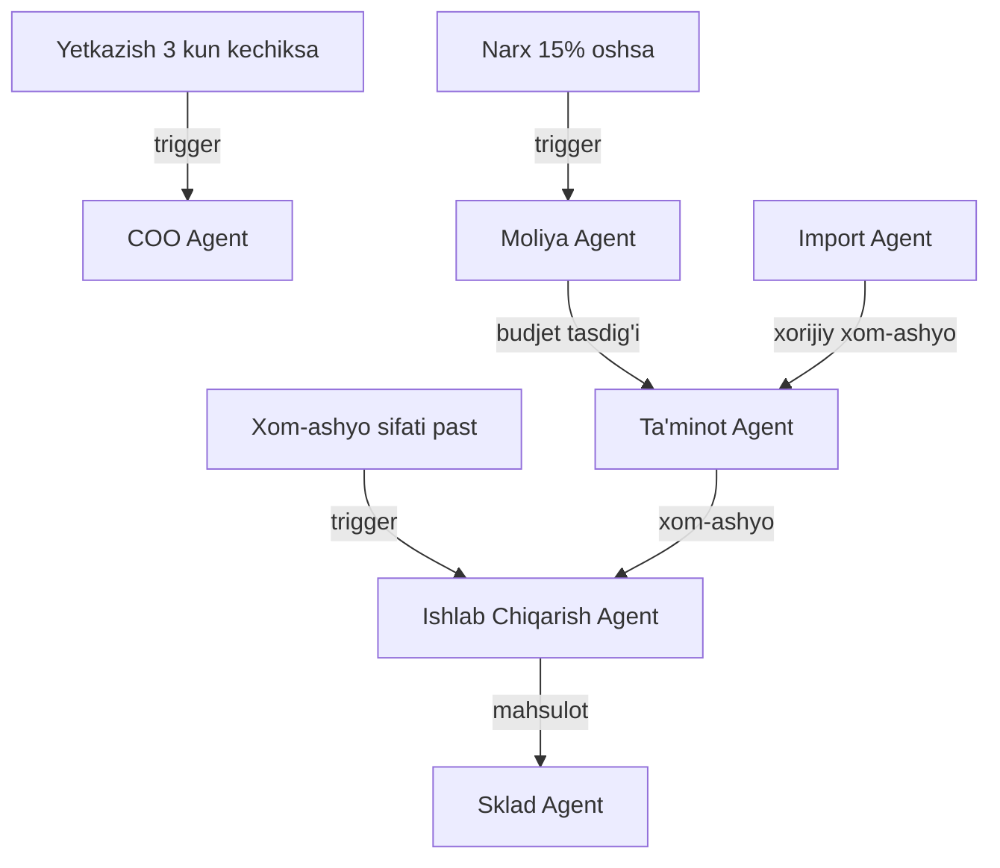

# 🚚 Ta'minot Agent

> **Bot Router:** `@xamxam_taminot_bot` | **Target KPI:** 14 Kunlik Prognoz

## Bo'limlar

| # | Bo'lim | Fayl |
|---|--------|------|
| 1 | Xomashyo Nazorati | [[Xomashyo_Nazorati_Agent]] |
| 2 | Qoldiq Nazorati | [[Qoldiq_Nazorati_Agent]] |
| 3 | Ehtiyoj Prognozi | [[Ehtiyoj_Prognozi_Agent]] |
| 4 | Minimal Zaxira | [[Minimal_Zaxira_Agent]] |
| 5 | Muammo Signal | [[Muammo_Signal_Agent]] |

## ERP Kiruvchi (Inputs)

| Manba | Ma'lumot turi | chastotasi |
|-------|---------------|------------|
| [[Ishlab_Chiqarish_Agent]] | Xom-ashyo kerakligi | Kunlik |
| [[Sklad_Agent]] | Ombor qoldig'i | Kunlik |
| [[Import_Agent]] | Import xom-ashyosi | Kerak bo'lganda |
| [[Moliya_Agent]] | Ta'minot budjeti | Oylik |

## ERP Chiquvchi (Outputs)

| Qabul qiluvchi | Ma'lumot turi | chastotasi |
|----------------|---------------|------------|
| [[Ishlab_Chiqarish_Agent]] | Xom-ashyo yetkazish | Kunlik |
| [[Sklad_Agent]] | Xom-ashyo qabuli | Kunlik |
| [[Buxgalteriya_Agent]] | Xarajat hisoboti | Oylik |
| [[Analitika_Agent]] | Ta'minot KPI | Haftalik |
| [[CEO_AI_Yordamchisi_Agent]] | 14 kunlik prognoz xulosasi | Haftalik |

## Cascade Rules (Zanjirli Bog'liqliklar)

| holat | Harakat | Mas'ul |
|-------|---------|--------|
| Yetkazish 3 kun kechiksa | [[COO_Agent]] ga shoshilinch xabar | Ta'minot |
| Xom-ashyo sifati past | [[Ishlab_Chiqarish_Agent]] ga ogohlantirish, qaytarish | Ta'minot |
| Narx 15% oshsa | [[Moliya_Agent]] ga hisobot, alternativa izlash | Ta'minot |
| Yangi yetkazib beruvchi | [[Yuridik_Agent]] ga shartnoma tuzish | Ta'minot |

## Keyinchalik Bog'liqlar

- [[Taminot_Departamenti]] — umumiy dashboard
- [[HR_Departamenti]] — ta'minot xodimlari
- [[Ishlab_Chiqarish_Agent]] — xom-ashyo iste'molchisi
- [[Sklad_Agent]] — xom-ashyo saqlash
- [[Import_Agent]] — xorijiy xom-ashyo
- [[Moliya_Agent]] — budjet nazorati
- [[Buxgalteriya_Agent]] — xarajat hisoboti
- [[Analitika_Agent]] — ta'minot KPI
- [[Yuridik_Agent]] — shartnomalar
- [[COO_Agent]] — operatsion boshqaruv
