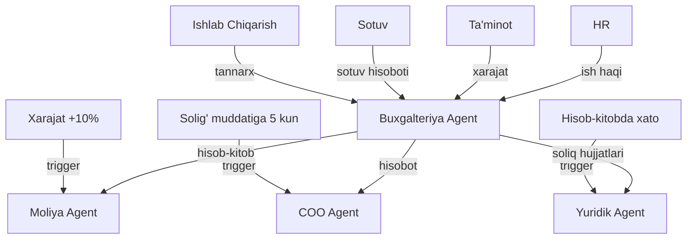

# 📊 Buxgalteriya Agent

## ERP输入 (inputs_from)

| Manba | Ma'lumot turi | chastotasi |
|-------|---------------|------------|
| [[Ishlab_Chiqarish_Agent]] | Tannarx hisoboti | Oylik |
| [[Sotuv_Agent]] | Sotuv hisoboti | Kunlik |
| [[Taminot_Agent]] | Xarajat hisoboti | Oylik |
| [[Marketing_Agent]] | Marketing xarajatlari | Oylik |
| [[Sklad_Agent]] | Ombor qiymati | Oylik |
| [[HR_Agent]] | Ish haqi va imtiyozlar | Oylik |
| [[Import_Agent]] | Import xarajatlari | Kerak bo'lganda |
| [[Export_Agent]] | Export tushumlari | Kerak bo'lganda |

## ERP输出 (outputs_to)

| Qabul qiluvchi | Ma'lumot turi | chastotasi |
|----------------|---------------|------------|
| [[Moliya_Agent]] | Umumiy hisob-kitob | Oylik |
| [[COO_Agent]] | Moliyaviy hisobot | Oylik |
| [[Yuridik_Agent]] | Soliq hujjatlari | Oylik |
| [[Analitika_Agent]] | Buxgalteriya KPI | Haftalik |

## Cascade Rules (Zanjirli Bog'liqliklar)

| holat | Harakat | Mas'ul |
|-------|---------|--------|
| Soliq muddatiga 5 kun | [[COO_Agent]] ga eslatma | Buxgalteriya |
| Hisob-kitobda xato | [[Yuridik_Agent]] ga tekshiruv | Buxgalteriya |
| Xarajat +10% | [[Moliya_Agent]] ga hisobot | Buxgalteriya |
| Audit | [[Yuridik_Agent]] bilan hamkorlik | Buxgalteriya |

## Keyinchalik Bog'liqlar

- [[Abdulloh_Legal_Buxgalteriya_TIF]] — umumiy dashboard
- [[Moliya_Agent]] — moliyaviy boshqaruv
- [[COO_Agent]] — operatsion boshqaruv
- [[Yuridik_Agent]] — soliq va audit
- [[Analitika_Agent]] — buxgalteriya KPI
- [[Ishlab_Chiqarish_Agent]] — tannarx manbai
- [[Sotuv_Agent]] — sotuv hisoboti
- [[Taminot_Agent]] — xarajat manbai
- [[Sklad_Agent]] — ombor qiymati
- [[HR_Agent]] — ish haqi
- [[Import_Agent]] — import xarajatlari
- [[Export_Agent]] — export tushumlari
