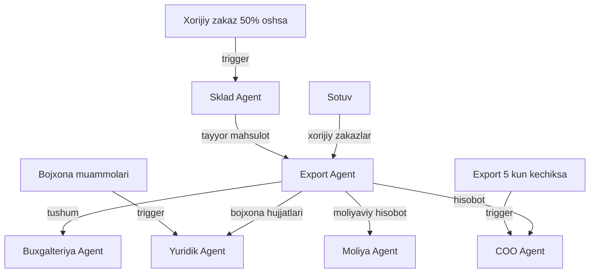

# 🌏 Export Agent

## ERP输入 (inputs_from)

| Manba | Ma'lumot turi | chastotasi |
|-------|---------------|------------|
| [[Sotuv_Agent]] | Xorijiy zakazlar | Kerak bo'lganda |
| [[Sklad_Agent]] | Export uchun tayyor mahsulot | Haftalik |
| [[Yuridik_Agent]] | Export hujjatlari | Kerak bo'lganda |
| [[Moliya_Agent]] | Export budjeti | Oylik |

## ERP输出 (outputs_to)

| Qabul qiluvchi | Ma'lumot turi | chastotasi |
|----------------|---------------|------------|
| [[Buxgalteriya_Agent]] | Export tushumlari | Kunlik |
| [[Yuridik_Agent]] | Bojxona hujjatlari | Kerak bo'lganda |
| [[Moliya_Agent]] | Export moliyaviy hisoboti | Oylik |
| [[Analitika_Agent]] | Export KPI | Haftalik |
| [[COO_Agent]] | Export hisoboti | Haftalik |

## Cascade Rules (Zanjirli Bog'liqliklar)

| holat | Harakat | Mas'ul |
|-------|---------|--------|
| Export 5 kun kechiksa | [[COO_Agent]] ga shoshilinch xabar | Export |
| Xorijiy zakaz +50% | [[Sklad_Agent]] ga zaxira ko'paytirish | Export |
| Bojxona muammolari | [[Yuridik_Agent]] ga yordam | Export |
| Yangi bozor | [[Marketing_Agent]] ga tadqiqot | Export |

## Keyinchalik Bog'liqlar

- [[Abdulloh_Legal_Buxgalteriya_TIF]] — umumiy dashboard
- [[Sotuv_Agent]] — xorijiy zakazlar manbai
- [[Sklad_Agent]] — tayyor mahsulot
- [[Yuridik_Agent]] — bojxona hujjatlari
- [[Moliya_Agent]] — export budjeti
- [[Buxgalteriya_Agent]] — export tushumlari
- [[Analitika_Agent]] — export KPI
- [[Marketing_Agent]] — yangi bozorlar
- [[COO_Agent]] — operatsion boshqaruv
