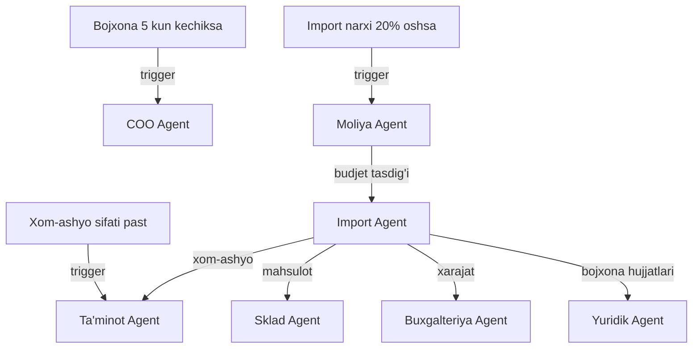

# 🌍 Import Agent

## ERP输入 (inputs_from)

| Manba | Ma'lumot turi | chastotasi |
|-------|---------------|------------|
| [[Taminot_Agent]] | Import kerakligi | Kerak bo'lganda |
| [[Yuridik_Agent]] | Import hujjatlari | Kerak bo'lganda |
| [[Moliya_Agent]] | Import budjeti | Oylik |
| [[Sklad_Agent]] | Import zaxirasi | Haftalik |

## ERP输出 (outputs_to)

| Qabul qiluvchi | Ma'lumot turi | chastotasi |
|----------------|---------------|------------|
| [[Taminot_Agent]] | Import xom-ashyosi | Kerak bo'lganda |
| [[Sklad_Agent]] | Import mahsulotlari | Kerak bo'lganda |
| [[Buxgalteriya_Agent]] | Import xarajatlari | Oylik |
| [[Yuridik_Agent]] | Bojxona hujjatlari | Kerak bo'lganda |
| [[Analitika_Agent]] | Import KPI | Haftalik |

## Cascade Rules (Zanjirli Bog'liqliklar)

| holat | Harakat | Mas'ul |
|-------|---------|--------|
| Bojxona 5 kun kechiksa | [[COO_Agent]] ga shoshilinch xabar | Import |
| Import narxi +20% | [[Moliya_Agent]] ga hisobot, alternativa izlash | Import |
| Xom-ashyo sifati past | [[Taminot_Agent]] ga ogohlantirish, qaytarish | Import |
| Yangi mamlakat | [[Yuridik_Agent]] ga bojxona qoidalari | Import |

## Keyinchalik Bog'liqlar

- [[Abdulloh_Legal_Buxgalteriya_TIF]] — umumiy dashboard
- [[Taminot_Agent]] — xom-ashyo iste'molchisi
- [[Sklad_Agent]] — mahsulot saqlash
- [[Moliya_Agent]] — import budjeti
- [[Buxgalteriya_Agent]] — import xarajatlari
- [[Yuridik_Agent]] — bojxona hujjatlari
- [[Analitika_Agent]] — import KPI
- [[COO_Agent]] — operatsion boshqaruv
