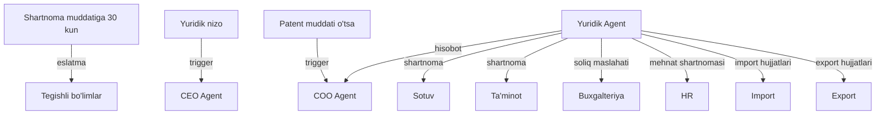

# ⚖️ Yuridik Agent

## ERP输入 (inputs_from)

| Manba | Ma'lumot turi | chastotasi |
|-------|---------------|------------|
| [[Sotuv_Agent]] | Sotuv shartnomalari | Kerak bo'lganda |
| [[Taminot_Agent]] | Ta'minot shartnomalari | Kerak bo'lganda |
| [[Import_Agent]] | Import hujjatlari | Kerak bo'lganda |
| [[Export_Agent]] | Export hujjatlari | Kerak bo'lganda |
| [[Buxgalteriya_Agent]] | Soliq hujjatlari | Oylik |
| [[HR_Agent]] | Mehnat shartnomalari | Kerak bo'lganda |

## ERP输出 (outputs_to)

| Qabul qiluvchi | Ma'lumot turi | chastotasi |
|----------------|---------------|------------|
| [[COO_Agent]] | Yuridik hisobot | Oylik |
| [[CEO_Agent]] | Strategik yuridik maslahat | Kerak bo'lganda |
| [[Sotuv_Agent]] | Shartnoma shablonlari | Kerak bo'lganda |
| [[Taminot_Agent]] | Ta'minot shartnomalari | Kerak bo'lganda |
| [[Buxgalteriya_Agent]] | Soliq maslahatlari | Oylik |

## Cascade Rules (Zanjirli Bog'liqliklar)

| holat | Harakat | Mas'ul |
|-------|---------|--------|
| Shartnoma muddatiga 30 kun | Tegishli bo'limlarga eslatma | Yuridik |
| Yuridik nizo | [[CEO_Agent]] ga xabar | Yuridik |
| Patent muddati o'tsa | [[COO_Agent]] ga ogohlantirish | Yuridik |
| Soliq auditi | [[Buxgalteriya_Agent]] bilan hamkorlik | Yuridik |

## Keyinchalik Bog'liqlar

- [[Abdulloh_Legal_Buxgalteriya_TIF]] — umumiy dashboard
- [[COO_Agent]] — operatsion boshqaruv
- [[CEO_Agent]] — strategik qarorlar
- [[Sotuv_Agent]] — sotuv shartnomalari
- [[Taminot_Agent]] — ta'minot shartnomalari
- [[Buxgalteriya_Agent]] — soliq hujjatlari
- [[HR_Agent]] — mehnat shartnomalari
- [[Import_Agent]] — import hujjatlari
- [[Export_Agent]] — export hujjatlari
