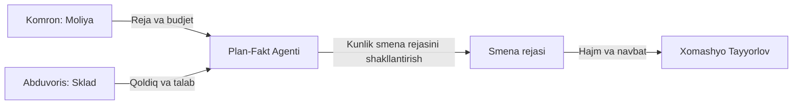

# 📊 Plan-Fakt — Kunlik Smena va Hajm Rejasi

## Input Manbalari

| Manba | Ma'lumot turi |
|-------|---------------|
| [[Komron_Moliya_Analitika]] | Moliyaviy reja, budjet limitlari |
| [[Abduvoris_Sklad_Marketing]] | Ombordagi qoldiq, talab prognozi |

## Jarayon

1. **Reja olish**: [[Komron_Moliya_Analitika]] dan oylik/yillik reja olinadi
2. **Qoldiq tekshirish**: [[Abduvoris_Sklad_Marketing]] dan ombordagi qoldiq olinadi
3. **Smena rejasini shakllantirish**: Kunlik ishlab chiqarish hajmi belgilanadi
4. **Navbat belgilash**: Qaysi mahsulot avval ishlab chiqariladi

## Vazifalar

- [ ] Kunlik smena rejasini yaratish
- [ ] Hajm rejasini hisoblash
- [ ] Navbatni optimallashtirish
- [ ] Plan vs Fakt taqqoslash

## Output

→ [[Xomashyo_Tayyorlov]] — tayyor reja asosida xom-ashyo tayyorlash boshlanadi

## Keyinchalik Bog'liqlar

- [[Sardor_General_Overview]] — umumiy dashboard
- [[Komron_Moliya_Analitika]] — moliyaviy ma'lumotlar
- [[Abduvoris_Sklad_Marketing]] — ombor ma'lumotlari
- [[Xomashyo_Tayyorlov]] — keyingi qadam
