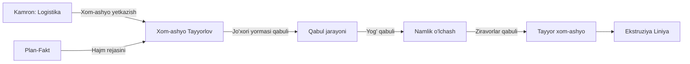

# 🌾 Xom-ashyo Tayyorlov — Qabul va Tayyorlash

## Input Manbalari

| Manba | Ma'lumot turi |
|-------|---------------|
| [[Kamron_HR_Logistika_Taminot]] | Xom-ashyo yetkazish, transport |
| [[Plan_Fakt]] | Kunlik smena rejasidagi hajm |

## Jarayon

1. **Jo'xori yormasi qabuli**: Yuk tashish va omborga joylashtirish
2. **Yog' qabuli**: Sifat tekshiruvi, namlik o'lchash
3. **Ziravorlar qabuli**: Tur, sifat va miqdor tekshiruvi
4. **Namlik o'lchash**: Har bir xom-ashyo uchun namlik darajasi

## Xom-ashyo Turlari

| Xom-ashyo | Manba | Namlik normasi |
|-----------|-------|----------------|
| Jo'xori yormasi | [[Kamron_HR_Logistika_Taminot]] | ≤ 14% |
| Yog' | [[Kamron_HR_Logistika_Taminot]] | ≤ 0.5% |
| Ziravorlar | [[Kamron_HR_Logistika_Taminot]] | ≤ 10% |

## Vazifalar

- [ ] Xom-ashyo qabul protsedurasini bajarish
- [ ] Namlik o'lchash natijalarini yozish
- [ ] Sifat darajasini baholash
- [ ] Xom-ashyo saqlash joyini belgilash

## Output

→ [[Ekstruziya_Liniya]] — tayyor xom-ashyo ekstruziya liniyasiga uzatiladi

## Keyinchalik Bog'liqlar

- [[Sardor_General_Overview]] — umumiy dashboard
- [[Kamron_HR_Logistika_Taminot]] — xom-ashyo yetkazish
- [[Plan_Fakt]] — smena rejasidagi hajm
- [[Ekstruziya_Liniya]] — keyingi qadam
