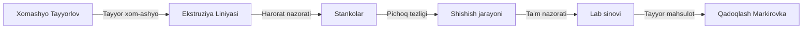

# ⚙️ Ekstruziya Liniyasi — Asosiy Ishlab chiqarish

## Input Manbalari

| Manba | Ma'lumot turi |
|-------|---------------|
| [[Xomashyo_Tayyorlov]] | Tayyor xom-ashyo (jo'xori yormasi, yog', ziravorlar) |

## Jarayon

1. **Stankolar harorati**: Har bir stankoning ish harorati nazorat qilinadi
2. **Pichoq tezligi**: Mahsulotning shakli va hajmi belgilanadi
3. **Shishish jarayoni**: Xom-ashyo ekstruziya orqali shishadi
4. **Ta'm nazorati**: Har soatda ta'm va tashqi ko'rinish tekshiriladi

## Parametrlar

| Parametr | Norma | Chegara |
|----------|-------|---------|
| Harorat | 120–140°C | ±5°C |
| Pichoq tezligi | 800–1000 rpm | ±50 rpm |
| Bosim | 15–20 MPa | ±2 MPa |
| Mahsulot qalinligi | 2.5 mm | ±0.3 mm |

## Vazifalar

- [ ] Stankolar haroratini monitoring qilish
- [ ] Pichoq tezligini sozlash
- [ ] Shishish jarayonini nazorat qilish
- [ ] Ta'm va tashqi ko'rishni tekshirish
- [ ] Texnik nosozliklarni aniqlash va bartaraf etish

## Output

→ [[Qadoqlash_Markirovka]] — tayyor mahsulot qadoqlashga uzatiladi

## Keyinchalik Bog'liqlar

- [[Sardor_General_Overview]] — umumiy dashboard
- [[Xomashyo_Tayyorlov]] — xom-ashyo manbai
- [[Qadoqlash_Markirovka]] — keyingi qadam
- [[Sifat_Brak_Nazorati]] — sifat nazorati
