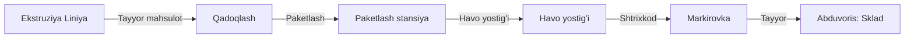

# 📦 Qadoqlash va Markirovka

## Input Manbalari

| Manba | Ma'lumot turi |
|-------|---------------|
| [[Ekstruziya_Liniya]] | Tayyor mahsulot (shishgan holda) |

## Jarayon

1. **Paketlash**: Mahsulot tegishli o'lchamdagi paketga joylashtiriladi
2. **Havo yostig'i**: Paket ichiga havo yostig'i qo'yiladi (sinishdan himoya)
3. **Shtrixkodlash**: Har bir paketga shtrixkod yaratiladi va bosiladi
4. **Markirovka**: Sana, partiya raqami, og'irlik ko'rsatiladi

## Qadoqlash Standartlari

| Mahsulot turi | Paket hajmi | Havo yostig'i | Shtrixkod |
|---------------|-------------|---------------|-----------|
| Standart | 50×30×25 cm | Ha | GS1-128 |
| Premium | 40×25×20 cm | Ha | GS1-128 |
| Optsiya | 60×40×30 cm | Ha | GS1-128 |

## Vazifalar

- [ ] Mahsulotni paketlash
- [ ] Havo yostig'ini joylashtirish
- [ ] Shtrixkod yaratish va bosish
- [ ] Markirovka ma'lumotlarini tekshirish
- [ ] Tayyor paketlarni tayyorlash

## Output

→ [[Abduvoris_Sklad_Marketing]] — markaziy omborga topshiriladi

## Keyinchalik Bog'liqlar

- [[Sardor_General_Overview]] — umumiy dashboard
- [[Ekstruziya_Liniya]] — mahsulot manbai
- [[Abduvoris_Sklad_Marketing]] — omborga topshirish
- [[Sifat_Brak_Nazorati]] — sifat nazorati
