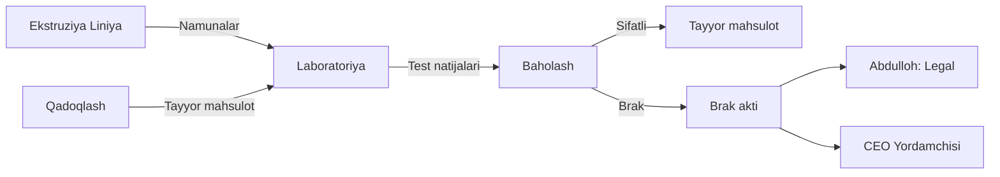

# 🔬 Sifat va Brak Nazorati

## Input Manbalari

| Manba | Ma'lumot turi |
|-------|---------------|
| [[Ekstruziya_Liniya]] | Ishlab chiqarilgan mahsulot namunalari |
| [[Qadoqlash_Markirovka]] | Qadoqlangan mahsulotlar |

## Jarayon

1. **Laboratoriya testlari**: Namlik, tarkib, rang, ta'm tekshiriladi
2. **Namlik o'lchash**: Mahsulotning namlik darajasi o'lchanadi
3. **Brak aniqlash**: Standartga mos kelmaydigan mahsulotlar ajratiladi
4. **Brak akti**: Brak mahsulotlar uchun rasmiy hujjat tuziladi

## Sifat Standartlari

| Ko'rsatkich | Norma | Brak chegarasi |
|-------------|-------|----------------|
| Namlik | ≤ 8% | > 10% |
| Rang | Standart | 30% dan ortiq farq |
| Ta'm | Standart | Yoqimsiz |
| Shtrixkod | O'qilishi kerak | O'qilmaydi |

## Vazifalar

- [ ] Laboratoriya testlarini o'tkazish
- [ ] Namlik darajasini o'lchash
- [ ] Brak mahsulotlarni ajratish
- [ ] Brak aktini rasmiylashtirish
- [ ] Sifat hisobotini tuzish

## Output

| Qabul qiluvchi | Ma'lumot |
|----------------|----------|
| [[Abdulloh_Legal_Buxgalteriya_TIF]] | Brak akti, tannarx tuzatish |
| [[CEO_Yordamchisi]] | Sifat hisoboti, umumiy holat |

## Keyinchalik Bog'liqlar

- [[Sardor_General_Overview]] — umumiy dashboard
- [[Ekstruziya_Liniya]] — mahsulot manbai
- [[Qadoqlash_Markirovka]] — qadoqlangan mahsulot
- [[Abdulloh_Legal_Buxgalteriya_TIF]] — brak akti va tannarx
- [[CEO_Yordamchisi]] — sifat hisoboti
