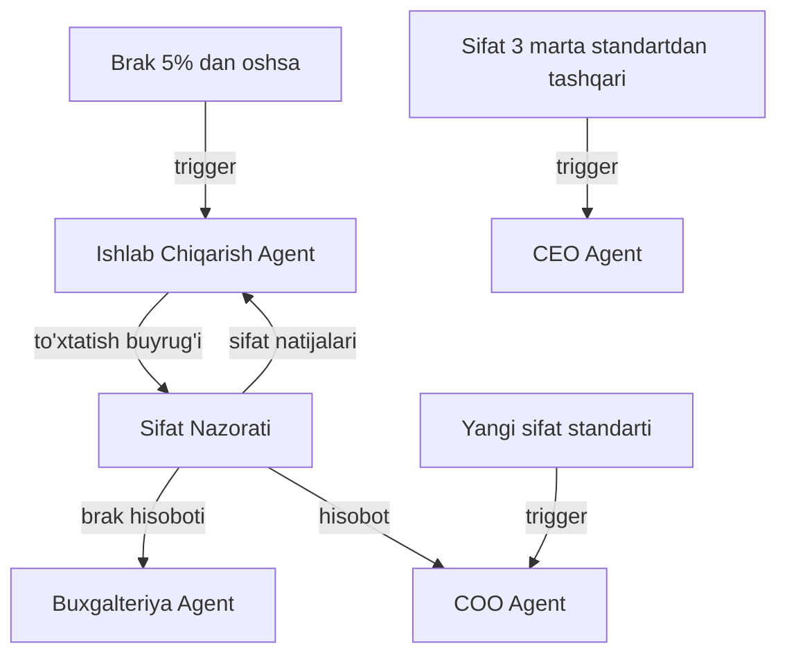

# 🔬 Sifat Nazorati Agent

## ERP输入 (inputs_from)

| Manba | Ma'lumot turi | chastotasi |
|-------|---------------|------------|
| [[Ishlab_Chiqarish_Agent]] | Ishlab chiqarilgan mahsulot namunalari | Har smena |
| [[Sklad_Agent]] | Ombordagi mahsulot sifati | Haftalik |

## ERP输出 (outputs_to)

| Qabul qiluvchi | Ma'lumot turi | chastotasi |
|----------------|---------------|------------|
| [[Ishlab_Chiqarish_Agent]] | Sifat natijalari, ogohlantirishlar | Har smena |
| [[Buxgalteriya_Agent]] | Brak hisoboti, yo'qotishlar | Oylik |
| [[COO_Agent]] | Sifat hisoboti | Haftalik |
| [[CEO_Agent]] | Strategik sifat hisoboti | Oylik |

## Cascade Rules (Zanjirli Bog'liqliklar)

| holat | Harakat | Mas'ul |
|-------|---------|--------|
| Brak > 5% | [[Ishlab_Chiqarish_Agent]] ga to'xtatish buyrug'i | Sifat |
| Sifat 3 marta past | [[CEO_Agent]] ga strategik hisobot | Sifat |
| Yangi sifat standarti | [[COO_Agent]] ga tasdiqlash | Sifat |
| Audit | [[Yuridik_Agent]] bilan hamkorlik | Sifat |

## Keyinchalik Bog'liqlar

- [[Sardor_General_Overview]] — umumiy dashboard
- [[Ishlab_Chiqarish_Agent]] — mahsulot manbai
- [[Sklad_Agent]] — ombor mahsuloti
- [[Buxgalteriya_Agent]] — brak hisoboti
- [[COO_Agent]] — operatsion boshqaruv
- [[CEO_Agent]] — strategik hisobot
- [[Yuridik_Agent]] — sifat standartlari
