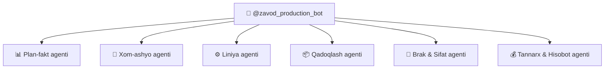

# 🤖 Production Bot Agents — @zavod_production_bot

`@zavod_production_bot` — ishlab chiqarish jarayonini boshqaruvchi Telegram bot. Ichida **6 ta agent** mavjud:

## Agentlar Tuzilishi

---

### 1. 📊 Plan-fakt Agenti

| Xususiyat | Tavsif |
|-----------|--------|
| vazifa | Kunlik smena rejasi va plan vs fakt taqqoslash |
| Input | [[Komron_Moliya_Analitika]], [[Abduvoris_Sklad_Marketing]] |
| Output | Kunlik plan-fakt hisoboti |

- Kunlik ishlab chiqarish rejasini yaratadi
- Fakt ishlab chiqarish hajmini kuzatadi
- Plan vs Fakt farqini hisoblaydi

### 2. 🌾 Xom-ashyo Agenti

| Xususiyat | Tavsif |
|-----------|--------|
| vazifa | Xom-ashyo qabuli, namlik o'lchash, saqlash |
| Input | [[Kamron_HR_Logistika_Taminot]] |
| Output | Xom-ashyo qabul hisoboti |

- Xom-ashyo yetkazilishini nazorat qiladi
- Namlik o'lchash natijalarini yozadi
- Ombordagi zaxirani hisoblaydi

### 3. ⚙️ Liniya Agenti

| Xususiyat | Tavsif |
|-----------|--------|
| vazifa | Ekstruziya liniyasi monitoringi |
| Input | [[Ekstruziya_Liniya]] sensorlari |
| Output | Liniya holati hisoboti |

- Stankolar haroratini kuzatadi
- Pichoq tezligini nazorat qiladi
- Texnik nosozliklarni aniqlaydi

### 4. 📦 Qadoqlash Agenti

| Xususiyat | Tavsif |
|-----------|--------|
| vazifa | Qadoqlash va markirovka jarayoni |
| Input | [[Qadoqlash_Markirovka]] |
| Output | Qadoqlash hisoboti |

- Paketlash sonini hisoblaydi
- Shtrixkod o'qilishini tekshiradi
- Havo yostig'i ishlatilishini nazorat qiladi

### 5. 🔬 Brak & Sifat Agenti

| Xususiyat | Tavsif |
|-----------|--------|
| vazifa | Sifat nazorati va brak aniqlash |
| Input | [[Sifat_Brak_Nazorati]] |
| Output | Sifat va brak hisoboti |

- Laboratoriya test natijalarini qayta ishlaydi
- Brak mahsulotlarni aniqlaydi
- Brak aktni rasmiylashtiradi

### 6. 💰 Tannarx & Hisobot Agenti

| Xususiyat | Tavsif |
|-----------|--------|
| vazifa | Ishlab chiqarish tannarxi va umumiy hisobot |
| Input | Barcha agentlardan kelgan ma'lumotlar |
| Output | Tannarx hisoboti, CEO hisoboti |

- Xom-ashyo xarajatlarini hisoblaydi
- Energiya va ishchi kuchi xarajatlarini qo'shadi
- Umumiy tannarxni hisoblaydi

## Bog'liqliklar

- [[Sardor_General_Overview]] — umumiy dashboard
- [[Plan_Fakt]] — plan-fakt agenti jarayoni
- [[Xomashyo_Tayyorlov]] — xom-ashyo agenti jarayoni
- [[Ekstruziya_Liniya]] — liniya agenti jarayoni
- [[Qadoqlash_Markirovka]] — qadoqlash agenti jarayoni
- [[Sifat_Brak_Nazorati]] — sifat agenti jarayoni
- [[CEO_Yordamchisi]] — umumiy hisobotlar
