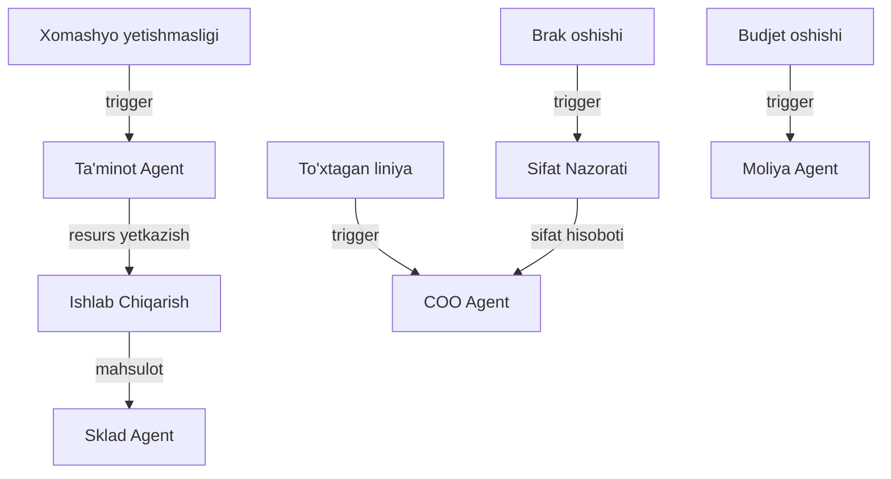

# 🏭 Ishlab Chiqarish Agent

## ERP输入 (inputs_from)

| Manba | Ma'lumot turi | chastotasi |
|-------|---------------|------------|
| [[Taminot_Agent]] | Xom-ashyo yetkazish | Kunlik |
| [[Sklad_Agent]] | Ombor qoldig'i va talab | Kunlik |
| [[Moliya_Agent]] | Ishlab chiqarish budjeti | Oylik |
| [[HR_Agent]] | Ishchi kuchi ro'yxati | Haftalik |

## ERP输出 (outputs_to)

| Qabul qiluvchi | Ma'lumot turi | chastotasi |
|----------------|---------------|------------|
| [[Sklad_Agent]] | Tayyor mahsulot | Har smena |
| [[Sifat_Nazorati_Agent]] | Namuna va sifat ma'lumotlari | Har smena |
| [[Buxgalteriya_Agent]] | Tannarx hisoboti | Oylik |
| [[Analitika_Agent]] | Ishlab chiqarish KPI | Haftalik |

## Cascade Rules (Zanjirli Bog'liqliklar)

| holat | Harakat | Mas'ul |
|-------|---------|--------|
| Xom-ashyo yetishmasligi | [[Taminot_Agent]] ga shoshilinch buyurtma | Ishlab Chiqarish |
| Liniya to'xtashi | [[COO_Agent]] ga xabar, [[HR_Agent]] dan qo'shimcha ishchi | COO |
| Brak 5% dan oshsa | [[Sifat_Nazorati_Agent]] to'liq tekshiruv | Sifat |
| Budjet 10% oshsa | [[Moliya_Agent]] ga hisobot | Moliya |

## Keyinchalik Bog'liqlar

- [[Sardor_General_Overview]] — umumiy dashboard
- [[Taminot_Agent]] — xom-ashyo manbai
- [[Sklad_Agent]] — mahsulot qabul qilish
- [[Moliya_Agent]] — budjet nazorati
- [[HR_Agent]] — ishchi kuchi
- [[Sifat_Nazorati_Agent]] — sifat nazorati
- [[Buxgalteriya_Agent]] — tannarx hisoboti
- [[Analitika_Agent]] — KPI
- [[COO_Agent]] — operatsion boshqaruv
