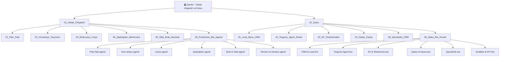
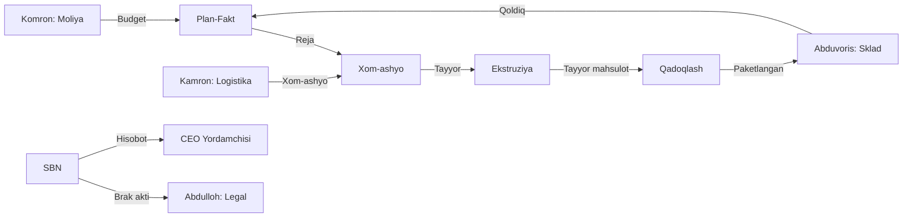
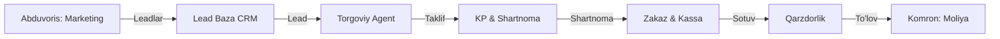

# 🏭 Sardor — Ishlab chiqarish va Sotuv

## Umumiy Dashboard

Sardor tashkilotning **ishlab chiqarish** va **sotuv** yo'nalishlariga mas'ul. Ikkita katta tizimni boshqaradi:

1. **Ishlab chiqarish (Production)** — 6 ta agent orqali
2. **Sotuv (Sales)** — 6 ta bot router orqali

## Tizim Tuzilishi

## Hamkorlik Bog'liqliklari

| Bo'lim | Qanday bog'langan | Qo'shimcha |
|--------|-------------------|------------|
| [[Abduvoris_Sklad_Marketing]] | Ombordagi qoldiq va leadlar | Marketing kampaniyalari |
| [[Kamron_HR_Logistika_Taminot]] | Xom-ashyo yetkazish va transport | HR — ishchi kuchi |
| [[Abdulloh_Legal_Buxgalteriya_TIF]] | Tannarx, shartnoma va eksport | Yuridik maslahat |
| [[Komron_Moliya_Analitika]] | KPI va sotuv dashboard | Moliyaviy hisobotlar |

## Ishlab chiqarish Oqimi

## Sotuv Oqimi

## Keyinchalik Bog'liqlar

- [[CEO_Yordamchisi]] — topshiriqlar va hisobotlar
- [[Abduvoris_Sklad_Marketing]] — ombor va leadlar
- [[Kamron_HR_Logistika_Taminot]] — xom-ashyo va transport
- [[Abdulloh_Legal_Buxgalteriya_TIF]] — tannarx va shartnomalar
- [[Komron_Moliya_Analitika]] — KPI va dashboard
