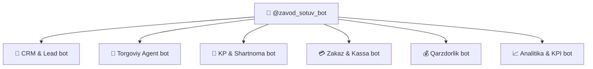

# 🛒 Sales Bot Router — @zavod_sotuv_bot

`@zavod_sotuv_bot` — sotuv jarayonini boshqaruvchi Telegram bot. Ichida **6 ta bot router** mavjud:

## Bot Router Tuzilishi

---

### 1. 🎯 CRM & Lead Bot

| Xususiyat | Tavsif |
|-----------|--------|
| vazifa | Lead bazasini boshqarish, CRM |
| Input | [[Abduvoris_Sklad_Marketing]] — marketing kampaniyalari |
| Output | Leadlar ro'yxati, CRM hisobotlari |

- Yangi leadlarni qabul qiladi
- Leadlar holatini yangilaydi
- CRM bazasini saqlaydi

### 2. 🤝 Torgoviy Agent Bot

| Xususiyat | Tavsif |
|-----------|--------|
| vazifa | Torgoviy agentlarning marshrutini boshqarish |
| Input | [[Abduvoris_Sklad_Marketing]] — do'konlar ro'yxati |
| Output | Marshrut rejasi, sotuv natijalari |

- Torgoviy agentlarning kunlik marshrutini tuzadi
- Do'konlarga tashrif jadvalini belgilaydi
- Sotuv natijalarini qabul qiladi

### 3. 📝 KP & Shartnoma Bot

| Xususiyat | Tavsif |
|-----------|--------|
| vazifa | Kommersiya taklifi va shartnomalar |
| Input | [[Abdulloh_Legal_Buxgalteriya_TIF]] — yuridik shablonlar |
| Output | KP fayllari, shartnoma nusxalari |

- KP (Kommersiya Taklifi) yaratadi
- Shartnoma loyihalarini tuzadi
- Yuridik tekshiruvdan o'tkazadi

### 4. 💳 Zakaz & Kassa Bot

| Xususiyat | Tavsif |
|-----------|--------|
| vazifa | Zakazlarni qabul qilish va kassa operatsiyalari |
| Input | [[Abduvoris_Sklad_Marketing]] — ombor qoldiqlari |
| Output | Zakazlar, kassa cheklari |

- Zakazlarni ro'yxatga oladi
- Ombordagi mavjudlikni tekshiradi
- Kassa operatsiyalarini boshqaradi

### 5. 💰 Qarzdorlik Bot

| Xususiyat | Tavsif |
|-----------|--------|
| vazifa | Qarzdorlikni nazorat qilish va eslatmalar |
| Input | [[Komron_Moliya_Analitika]] — moliyaviy ma'lumotlar |
| Output | Qarzdorlik ro'yxati, eslatmalar |

- Qarzdorliklar ro'yxatini saqlaydi
- To'lov eslatmalarini yuboradi
- Qarz yuritishni boshqaradi

### 6. 📈 Analitika & KPI Bot

| Xususiyat | Tavsif |
|-----------|--------|
| vazifa | Sotuv KPI va analitika |
| Input | Barcha bot routerlardan kelgan ma'lumotlar |
| Output | Sotuv dashboard, KPI hisobotlari |

- Kunlik/haftalik/oylik sotuvni hisoblaydi
- KPI ko'rsatkichlarini tahlil qiladi
- Dashboard yaratadi

## Bog'liqliklar

- [[Sardor_General_Overview]] — umumiy dashboard
- [[Abduvoris_Sklad_Marketing]] — ombor va leadlar
- [[Komron_Moliya_Analitika]] — moliyaviy ma'lumotlar
- [[Abdulloh_Legal_Buxgalteriya_TIF]] — yuridik shablonlar
- [[CEO_Yordamchisi]] — umumiy hisobotlar
