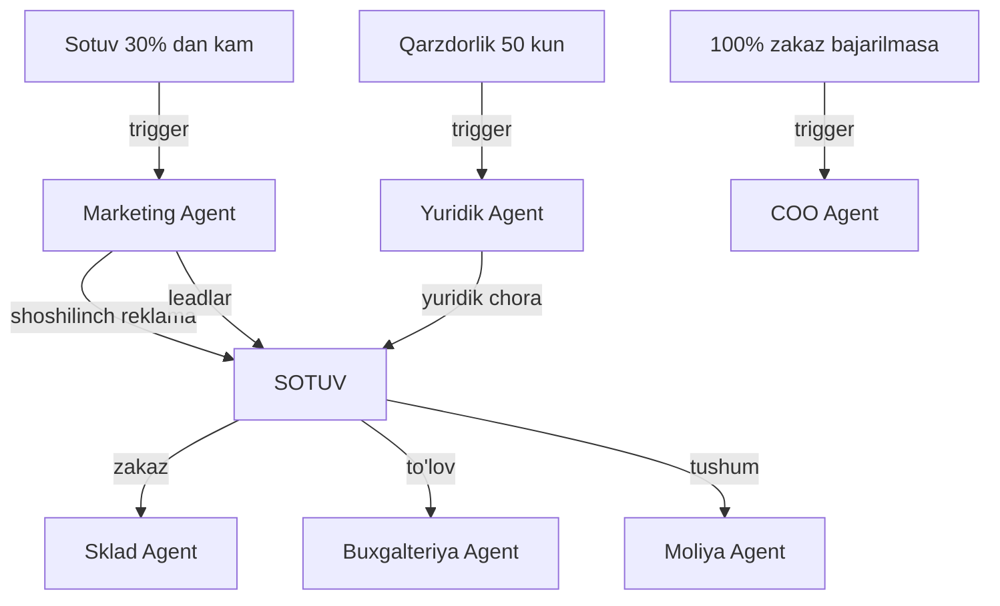

# 🛒 Sotuv Agent

## ERP输入 (inputs_from)

| Manba | Ma'lumot turi | chastotasi |
|-------|---------------|------------|
| [[Marketing_Agent]] | Leadlar ro'yxati | Kunlik |
| [[Sklad_Agent]] | Mahsulot mavjudligi | Real vaqt |
| [[Yuridik_Agent]] | Shartnoma shablonlari | Kerak bo'lganda |
| [[Buxgalteriya_Agent]] | Narxlar ro'yxati | Oylik |

## ERP输出 (outputs_to)

| Qabul qiluvchi | Ma'lumot turi | chastotasi |
|----------------|---------------|------------|
| [[Sklad_Agent]] | Zakazlar — mahsulot chiqarish | Real vaqt |
| [[Buxgalteriya_Agent]] | Sotuv hisoboti, qarzdorlik | Kunlik |
| [[Moliya_Agent]] | Sotuv tushumi | Kunlik |
| [[Analitika_Agent]] | Sotuv KPI | Haftalik |
| [[Export_Agent]] | Xorijiy zakazlar | Kerak bo'lganda |

## Cascade Rules (Zanjirli Bog'liqliklar)

| holat | Harakat | Mas'ul |
|-------|---------|--------|
| Sotuv 30% dan kam | [[Marketing_Agent]] ga shoshilinch reklama | Sotuv |
| Qarzdorlik 50 kun o'tsa | [[Yuridik_Agent]] ga yuridik chora | Sotuv |
| Zakaz 100% bajarilmasa | [[COO_Agent]] ga xabar | Sotuv |
| Yangi bozor | [[Export_Agent]] ga taklif | Sotuv |

## Keyinchalik Bog'liqlar

- [[Sardor_General_Overview]] — umumiy dashboard
- [[Marketing_Agent]] — lead manbai
- [[Sklad_Agent]] — mahsulot mavjudligi
- [[Yuridik_Agent]] — shartnomalar
- [[Buxgalteriya_Agent]] — hisob-kitob
- [[Moliya_Agent]] — tushum nazorati
- [[Analitika_Agent]] — sotuv KPI
- [[Export_Agent]] — xorijiy sotuv
- [[COO_Agent]] — operatsion boshqaruv
