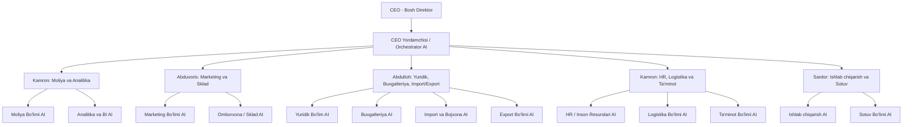

# 🏢 Tashkilot Tuzilmasi

## Qisqacha tavsif

| Lavozim | Mas'uliyat yo'nalishi |
|---|---|
| CEO | Umumiy boshqaruv |
| CEO Yordamchisi | Orchestrator AI — barcha yo'nalishlarni muvofiqlashtiradi |
| Kamron (1) | Moliya, Analitika, BI |
| Abduvoris | Marketing, Omborxona (Sklad) |
| Abdulloh | Yuridik, Buxgalteriya, Import/Export |
| Kamron (2) | HR, Logistika, Ta'minot |
| Sardor | Ishlab chiqarish, Sotuv |

## AI Botlar

Har bir bo'lim o'z AI botiga ega — ular CEO Yordamchisi (Orchestrator) orqali bog'lanadi va markazlashgan boshqaruvni ta'minlaydi.
